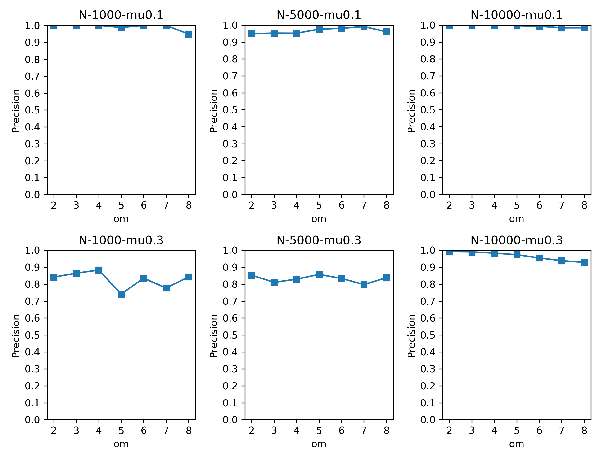
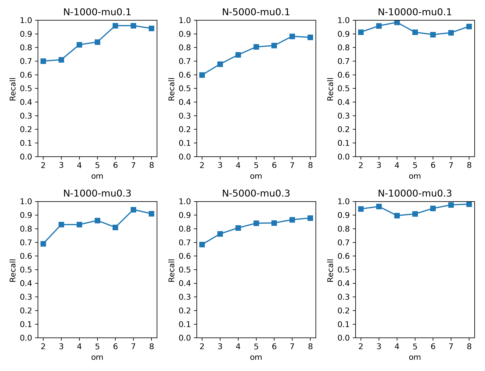
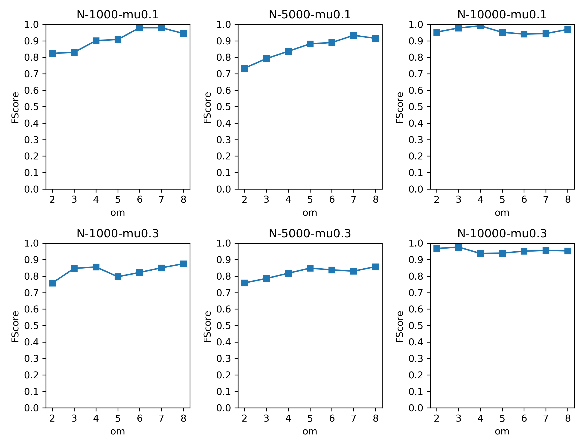
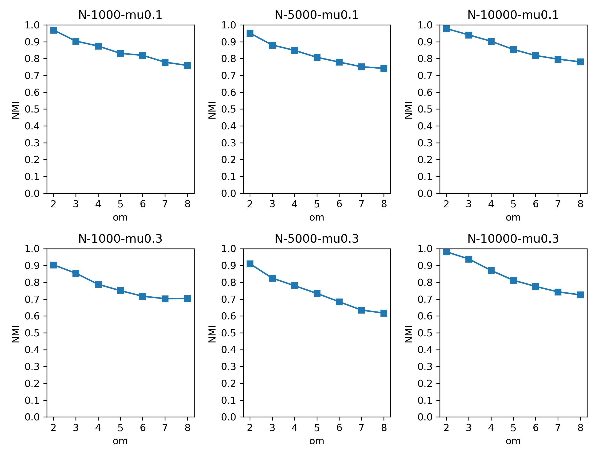
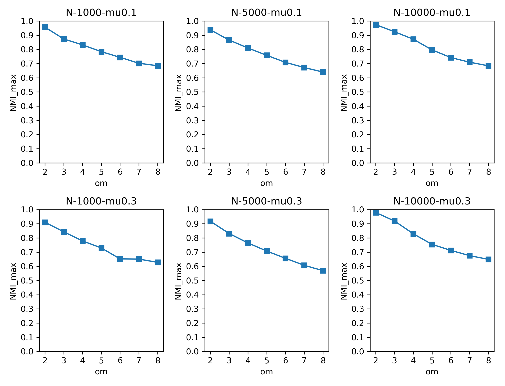
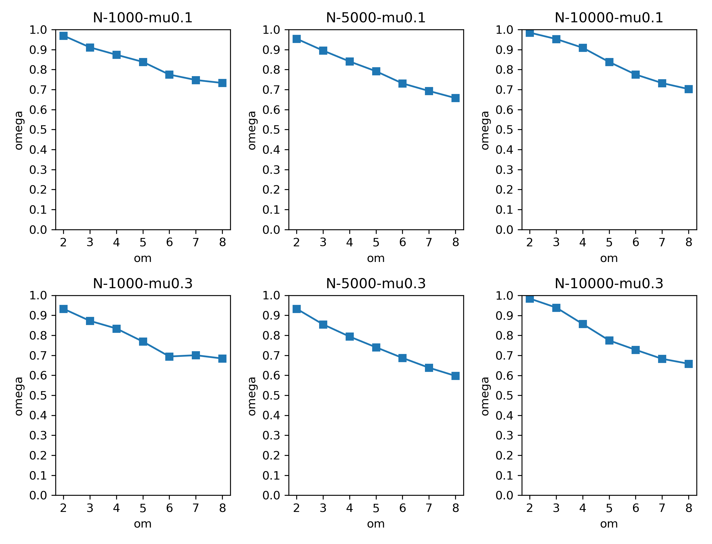

# LPANNI

Unofficial implementation of "LPANNI: Overlapping Community Detection Using Label Propagation in Large-Scale Complex Networks"[<sup>1</sup>](##Reference).


## Introduction

LPANNI is proposed for overlapping community detection. The main idea is based on Label Propagation Algorithm (LPA), which has linear time complexity and is able to detect community structures in large-scale complex networks. However, it does not support overlapping community detection and suffers from low accuracy and instability. Latter works (COPRA, SLPA and DLPA) were proposed to support overlapping community detection, but still suffer from low accuracy. LPANNI introduces the idea of neighbor node influence to distinguish between neighbor nodes during label propagation, and achieves higher accuracy.

The pipeline of LPANNI is as follows:

1. Calculate node importance NI of each node.
2. Calculate node similarity Sim between neighbor nodes.
3. Calculate neighbor node influence NNI between neighbor nodes.
4. Sort all nodes in ascending order according to NI and store them in `vQueue`.
5. In each label propagation iteration:
   1. For each node $u$ in `vQueue`:
      1. It receives multiple dominant labels from its neighbor nodes and forms label set $L_{Ng}$。
      2. Based on NNI and $L_{Ng}$, calculate the new belonging coefficient $b'(c,u)$ of node $u$ to community $c$.
      3. Adaptively delete the useless labels.
      4. Normalize the belonging coefficient of the labels.
      5. Identify the label with maximum belonging coefficient in $L_u$ as the dominant label of node $u$.
   2. If the size of label set and the dominant labels of all nodes don’t change, stop the iteration.
6. Output label set $L_u$ of node $u$, and get community structure.


## Dependencies

We implement LPANNI using C++ in Visual Studio 2017.  You can also run the code in any other environment with C++.

We use Python to generate LFR benchmark, evaluate performance and store community detection result into Neo4j. To setup the environment, install Python 3.x and packages in `requirements.txt`:

+ cdlib
+ jgraph
+ matplotlib
+ neo4j
+ networkx
+ numpy

We use [Neo4j](https://neo4j.com/) to store the results of community detection and support graph-related queries. 


## Implementation

We implement LPANNI using C++ in Visual Studio 2017. 

Graph data structures are defined in `src/LPANNI/graph.h` . We design data structures basing on the idea of adjacency list. A graph maintains a vector of nodes. Each node in graph maintains a set of adjacent nodes, and the neighborhood relationship is represented by a pair of directed edges `ToEdge`. For efficiency, we manage most of the edge attributes in another data structure `ToEdgeInfo` , and maintain a memory pool for all edges. 

Overall time complexity of LPANNI is $O((k^{\alpha-1}+1)m+(k^2+(T+1)k+1)n)$. 


## Dataset

Real networks:

+ [Com-Amazon Dataset](http://snap.stanford.edu/data/com-Amazon.html): Undirected community with 334,863 nodes and 925,872 edges. It is put under `data/Amazon`.

Synthetic networks:

+ 6*7=42 networks generated by LFR benchmark. They are put under `data/LFR/` .
+ 10 networks generated by LFR benchmark to evaluate time cost. They are put under `data/time complexity/` .

In `src/LFR/`, We provide an Windows executable program to generate LFR benchmark. To generate, run:

```powershell
.benchmark -k [k] -maxk [maxk] -mu [mu] -minc [minc] -maxc [maxc] -om [om] -N [N] -on [on]
```

For simplicity, run `src/LFR/generate.py` and it will run all commands for you:

```shell
python generate.py
```


## Time Complexity

According to the paper, the time complexity of LPANNI is $O((k^{\alpha-1}+1)m+(k^2+(T+1)k+1)n)$。We test our implementation on a personal computer:

+ Windows 10
+ Intel Core i7-8550U
+ 8.0 GB RAM

We follow the configurations in the paper, and repeat each experiment for 3 times.

Time of community detection:

| Number of Nodes | Time w/o building graph (second) | Time w/ building graph (second) |
| --------------- | -------------------------------- | ------------------------------- |
| 10000           | 3.08133                          | 3.51267                         |
| 20000           | 7.343                            | 7.81633                         |
| 30000           | 11.7357                          | 12.0133                         |
| 40000           | 16.0267                          | 17.3117                         |
| 50000           | 20.217                           | 22.138                          |
| 60000           | 25.0247                          | 26.8197                         |
| 70000           | 30.1703                          | 32.3223                         |
| 80000           | 35.3657                          | 38.0373                         |
| 90000           | 40.7283                          | 43.0053                         |
| 100000          | 45.9737                          | 48.8713                         |

This result is nearly 2 times faster compared with the time cost reported in the paper (figure 10).


## Evaluation

We follow the paper and use the following evaluation metrics:

+ Precision
+ Recall
+ F-score
+ NMI [<sup>2</sup>](##Reference)
+ NMI_max [<sup>3</sup>](##Reference)
+ omega [<sup>4</sup>](##Reference)

Evaluation codes are put under `src/Metrics`. Run `FScore.py` and `NMI_Omega.py` to evaluate, and run `plot.py` to plot evaluation results.

Precision on synthetic datasets:



Recall on synthetic datasets:



F-Score on synthetic datasets:



NMI on synthetic datasets:



NMI_max on synthetic datasets:



Omega on synthetic datasets:



## Query and Visualization

The native graph database [Neo4j](https://neo4j.com/) is used to store the results of community detection and support graph-related queries. The results are managed as labeled and directed graphs in Neo4j, of which the structure is shown below:

| Type         | Labels    | Properties | Meanings                                    |
| ------------ | --------- | ---------- | ------------------------------------------- |
| Node         | Node      | nid        | A node from the original datasets           |
| Node         | Community | cid        | A detected community                        |
| Relationship | Relation  | /          | An edge from the original datasets          |
| Relationship | BelongTo  | /          | A node belongs to some specific communities |
| Relationship | CenterAt  | /          | A community is centered at a specific node  |


Queries are executed in Neo4j Browser using Cypher, which is a declarative graph query language supported by Neo4j. Neo4j Browser also provides graph visualization for the query results. Here are two example queries:

+ Query for the communities containing a specific node, e.g. the node with nid = 1:
  + Cypher:  
    > MATCH (n:Node)-[:BelongTo]->(c:Community)  
    > WHERE n.nid = 1  
    > MATCH (cn:Node)-[:BelongTo]->(c)
    > RETURN c, cn  
  + Result Visualization:  
    
    >
+ Query for the communities that satisfy specific cardinality requirements, e.g. cardinality larger than 100:
  + Cypher:
    > MATCH (n:Node)-[:BelongTo]->(c:Community)  
    > WITH c, count(n) AS quantity  
    > WHERE quantity > 100  
    > WITH c  
    > MATCH (cn:Node)-[:BelongTo]->(c)  
    > RETURN c, cn  
    
    For large graphs, there may be too many matched communities and the Neo4j Browser may crash. It would be better to limit the number of matched communities using "WITH c LIMIT 1" instead of "WITH c" at the fourth line.
  + Result Visualization:
    
    >


## Reference

[1] Meilian, L. , Zhenlin, Z. , Zhihe, Q. , & Yu, K. . (2018). Lpanni: overlapping community detection using label propagation in large-scale complex networks. IEEE Transactions on Knowledge and Data Engineering, PP, 1-1.

[2] Lancichinetti, A. , Fortunato, S. , & Kertész, János. (2009). Detecting the overlapping and hierarchical community structure of complex networks. New Journal of Physics, 11(3).

[3] McDaid, A. F., Greene, D., & Hurley, N. (2011). Normalized mutual information to evaluate overlapping community finding algorithms. arXiv preprint arXiv:1110.2515.

[4] Linda, M., Collins, &, Clyde, & W., et al. (1988). Omega: a general formulation of the rand index of cluster recovery suitable for non-disjoint solutions. Multivariate Behavioral Research.